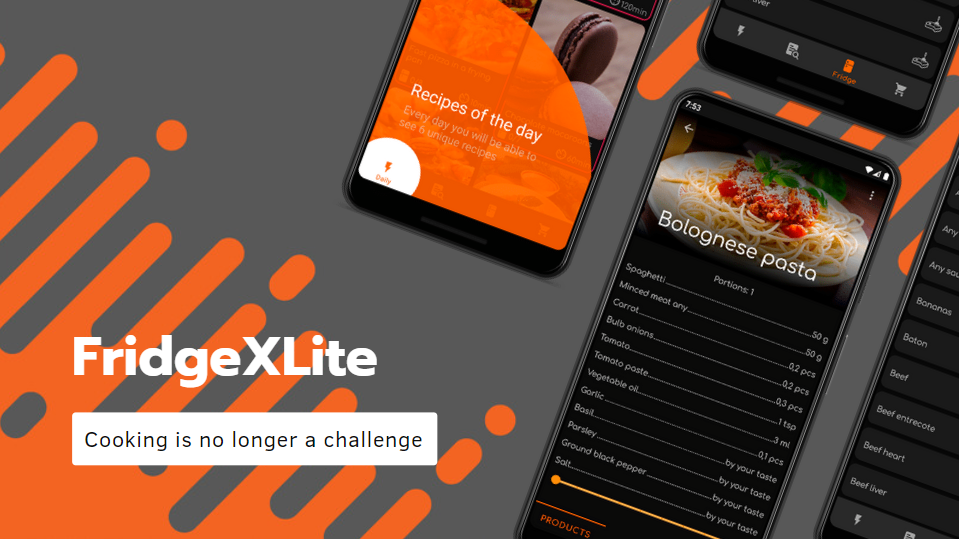
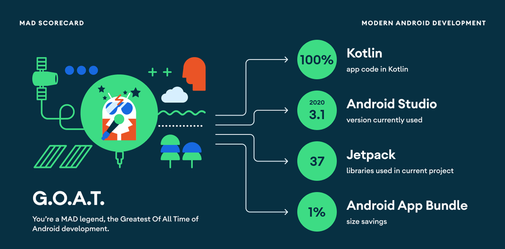
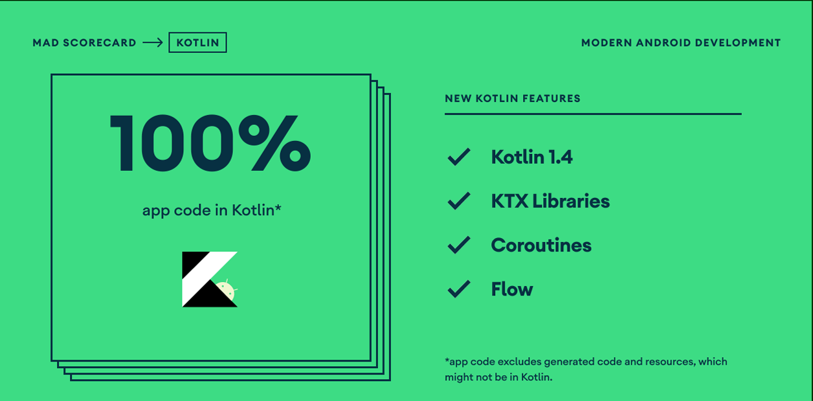

<h1 align="center">FridgeXLight</h1>

<p align="center">
  <a href="https://opensource.org/licenses/Apache-2.0"></a>
  <a href="https://android-arsenal.com/api?level=21"></a>
  <a href="https://github.com/t8rin/FridgeXLight/actions"></a> 
  <a href="https://github.com/t8rin"></a> 
</p>

<p align="center">  
FridgeXLight is a simple and handy application that allows you not to think about recipes.<br>Just add products products that you have in a fridge to get specially selected recipes based on them.<br>This project is for focusing especially on the showing mostly all material components and google guidelines
</p>
</br>

<p align="center">

</p>

## Download
Go to the [Releases](https://github.com/t8rin/FridgeXLight/releases) to download the latest APK.


## Tech stack & Open-source libraries
- Minimum SDK level 21

- [Kotlin](https://kotlinlang.org/) based 

- [Coroutines](https://github.com/Kotlin/kotlinx.coroutines) to optimize and move tasks to a secondary thread

- JetPack
  - Navigation Component - provides compat navigation between fragment's destinations
  - RecyclerView - for displaying large sets of data in UI while minimizing memory usage.

- [RxJava3](https://github.com/ReactiveX/RxJava), 
  [RxAndroid](https://github.com/ReactiveX/RxAndroid) and 
  [RxBinding](https://github.com/JakeWharton/RxBinding) for async search in database

- [Glide](https://github.com/bumptech/glide) - loading images.

- [TransformationLayout](https://github.com/skydoves/transformationlayout) - implementing transformation motion animations.

- [Material-Components](https://github.com/material-components/material-components-android) - Material design components like ripple animation, cardView.

- [TapTargetView](https://https://github.com/KeepSafe/TapTargetView) - made app guide intuitive and beautiful 

- SQLite database to store and get data


## MAD Score



## Architecture

will be here

# License
```xml
Designed and developed by 2021 T8RIN (Mukhametzyanov Malik)

Licensed under the Apache License, Version 2.0 (the "License");
you may not use this file except in compliance with the License.
You may obtain a copy of the License at

   http://www.apache.org/licenses/LICENSE-2.0

Unless required by applicable law or agreed to in writing, software
distributed under the License is distributed on an "AS IS" BASIS,
WITHOUT WARRANTIES OR CONDITIONS OF ANY KIND, either express or implied.
See the License for the specific language governing permissions and
limitations under the License.
```
